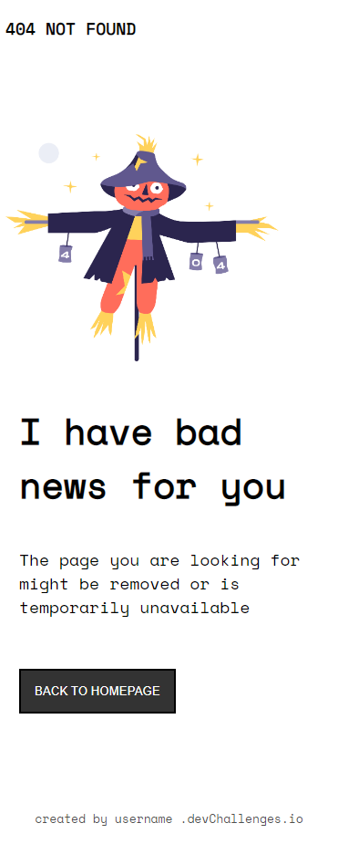
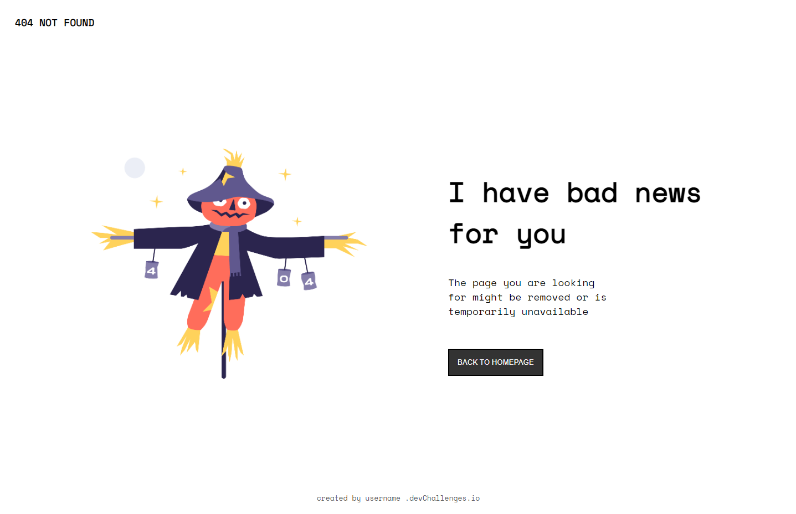

# 404 Not Found Page

Esta es una solución al proyecto **404 Not Found Page** del curso Make It Real.

## Tabla de contenido

- [404 Not Found Page](#404-not-found-page)
  - [Tabla de contenido](#tabla-de-contenido)
  - [Resumen](#resumen)
    - [El reto](#el-reto)
    - [Captura de pantalla](#captura-de-pantalla)
  - [Mi proceso](#mi-proceso)
    - [Construido con](#construido-con)
    - [Lo que aprendí](#lo-que-aprendí)
    - [Desarrollo continuo](#desarrollo-continuo)
    - [Recursos útiles](#recursos-útiles)
  - [Autor](#autor)

## Resumen

El reto consiste en generar, mediante HTML y CSS, una pagina que muestre el mensaje de error 404 junto con una explicación de la posible falla y una imagen alusiva al error. Adicionalmente, se debe mostrar un botón que pretende dirigir al usuario de regreso a la pagina principal.

### El reto

Los usuarios deben ser capaces de:

- Visualizar una pantalla de error 404 con una imagen alusiva al error y un boton de redirección a la pagina principal

### Captura de pantalla

Dispositivo móvil



Dispositivo de escritorio



## Mi proceso

- Identificar los diferentes contenedores de elementos HTML
- generar la estructura de la pagina con HTML haciendo énfasis en el contenido que debe tener cada contenedor
- crear la hoja de estilos CSS y usando la herramienta FlexBox generar los estilos correspondientes para dispositivos de hasta 375 pixeles de ancho
- crear una MediaQuery que modifique los estilos creados anteriormente para generar el contenido de un dispositivo de escritorio

### Construido con

- Marcado HTML5 semántico
- Propiedades personalizadas de CSS
- FlexBox
- Flujo de trabajo móvil primero

### Lo que aprendí

En este reto aprendimos a utilizar algunas de las propiedades de FlexBox que permitiron dar organizacion a la pagina. Estas son:

```css
display: flex;
```

Permite aplicar propiedades de FlexBox al elemento HTML que se le aplica esta propiedad asi como a sus elementos hijos.

```css
flex-direction: column || row;
```

permite organizar los elementos hijos en una fila o columna

```css
align-items: center;
```

permite alinear los elementos hijos en el centro del contenedor

```css
justify-content: space-between || center;
```

permite posicionar los elementos a lo largo del eje principal del contenedor

### Desarrollo continuo

Es de gran importancia seguir profundizando en en la herramienta FlexBox ya que permita dar una organización a las paginas de forma mas sencilla que el CSS básico

### Recursos útiles

- [ CSS-TRICKS ] (https://css-tricks.com/snippets/css/a-guide-to-flexbox/) - Este recurso nos mostró como utilizar de forma correcta las propiedades de FlexBox vistas anteriormente.

## Autor

- Adrian Camilo Gil
- Sebastian Alvarez Henao
-
