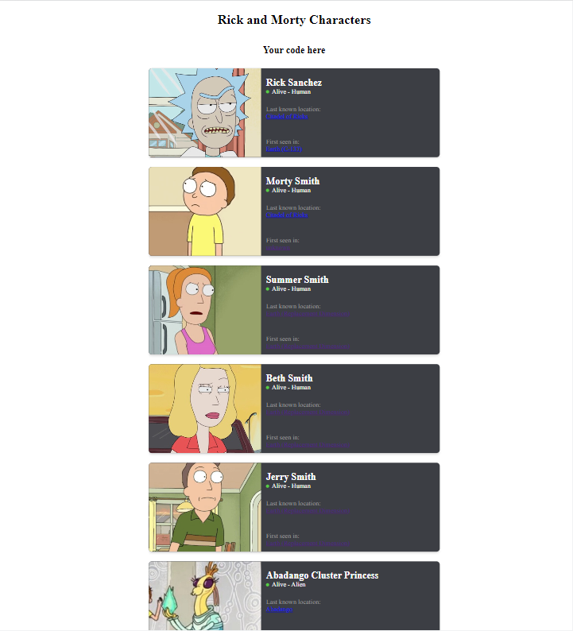

# Character Card

Esta es una solución al proyecto **Character Card** del curso Make It Real.

## Tabla de contenido

- [Character Card](#character-card)
  - [Tabla de contenido](#tabla-de-contenido)
  - [Resumen](#resumen)
    - [El reto](#el-reto)
    - [Captura de pantalla](#captura-de-pantalla)
    - [Construido con](#construido-con)
    - [Lo que aprendí](#lo-que-aprendí)
    - [Desarrollo continuo](#desarrollo-continuo)
    - [Recursos útiles](#recursos-útiles)
  - [Autor](#autor)

## Resumen

El reto consiste en generar, 20 tarjetas con algunos personajes de Rick y Morty y su información, todas las tarjetas deben ser generadas a partir del mismo componente.

La aplicación debe generarse a partir de una existente ([LINK](https://codesandbox.io/s/rick-and-morty-react-card-yvwlcb)) la cual contiene los datos de cada personaje y algunos estilos CSS

### El reto

Los usuarios deben ser capaces de:

- visualizar 20 tarjetas, cada una representa un personaje de la mencionada serie y contiene: una imagen, titulo, un icono que varia su color según el estado del personaje y mas información relacionada con cada personaje

### Captura de pantalla

### Construido con

- React
- Lenguaje JSX

### Lo que aprendí

- Traslado de información mediante `props`
- Sinterización de varios elementos partiendo de un solo componente

### Desarrollo continuo

Profundizar en React, haciendo énfasis en la inyección de código JS dentro del código JSX

### Recursos útiles

- [https://vitejs.dev/guide/](https://vitejs.dev/guide/): Este recurso explica la manera de crear un proyecto de react usando la herramienta VITE

## Autor

- Adrian Camilo Gil
- Sebastian Alvarez
