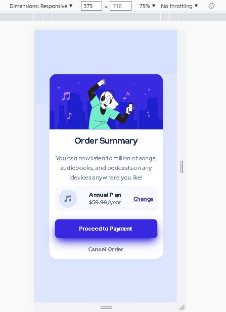
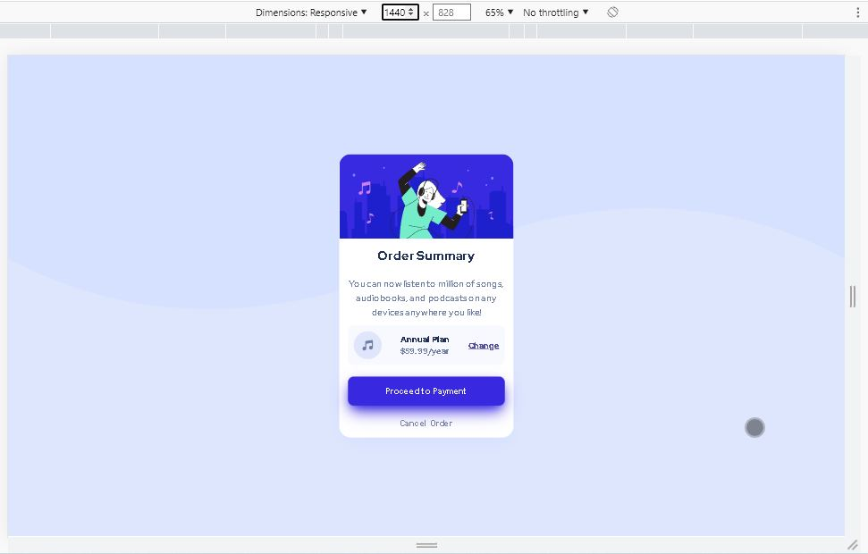

# Order Summary Card

Esta es una solución al proyecto **Order Summary Card** del curso Make It Real.

## Tabla de contenido

- [Order Summary Card](#order-summary-card)
  - [Tabla de contenido](#tabla-de-contenido)
  - [Resumen](#resumen)
    - [El reto](#el-reto)
    - [Captura de pantalla](#captura-de-pantalla)
  - [Mi proceso](#mi-proceso)
    - [Construido con](#construido-con)
    - [Lo que aprendí](#lo-que-aprendí)
    - [Desarrollo continuo](#desarrollo-continuo)
    - [Recursos útiles](#recursos-útiles)
  - [Autor](#autor)

## Resumen

El reto consiste en generar, mediante React un componente de tarjeta con dos botones, un enlace e información de relevancia para el usuario

### El reto

Los usuarios deben ser capaces de:

- visualizar el componente anteriormente descrito, este componente debe ser responsivo, generando una visualización móvil para dispositivos cuyo ancho sea inferior a 375 pixeles y otra visualización para dispositivos con pantallas mas grandes.

### Captura de pantalla

Dispositivo móvil

Dispositivo de escritorio

## Mi proceso

- Identificar los diferentes contenedores de elementos HTML
- generar la estructura de la pagina con HTML haciendo énfasis en el contenido que debe tener cada contenedor
- crear la hoja de estilos CSS y usando la herramienta FlexBox generar los estilos correspondientes para dispositivos de hasta 375 pixeles de ancho
- crear una MediaQuery que modifique los estilos creados anteriormente para generar el contenido de un dispositivo de escritorio

### Construido con

- React
- Lenguaje JSX

### Lo que aprendí

- Creación de un componente en React
- Creación de una hoja de estilos dedicada a un componente especifico

### Desarrollo continuo

Es de gran importancia seguir profundizando en React, sobre todo en los eventos del DOM, y los estados de los componentes

### Recursos útiles

- [https://vitejs.dev/guide/](https://vitejs.dev/guide/): Este recurso explica la manera de crear un proyecto de react usando la herramienta VITE

## Autor

- Adrian Camilo Gil
- Oscar Nuñes
