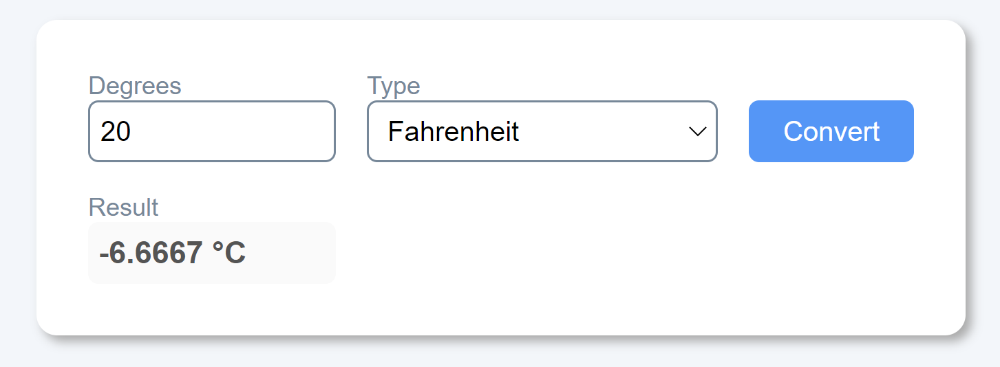
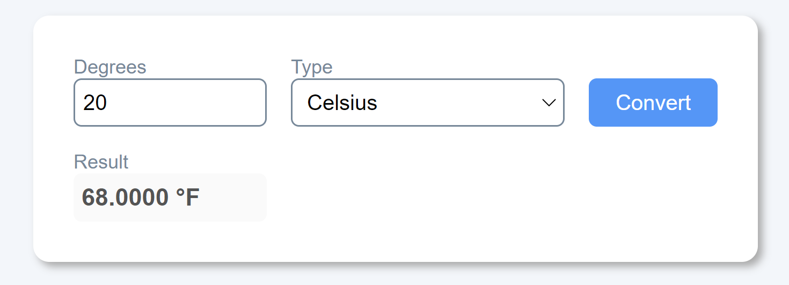

# Temperature Converter Website

Esta es una solución al proyecto **Temperature Converter Website** del curso Make It Real.

## Tabla de contenido

- [Temperature Converter Website](#temperature-converter-website)
  - [Tabla de contenido](#tabla-de-contenido)
  - [Resumen](#resumen)
    - [El reto](#el-reto)
    - [Captura de pantalla](#captura-de-pantalla)
    - [Construido con](#construido-con)
    - [Lo que aprendí](#lo-que-aprendí)
    - [Desarrollo continuo](#desarrollo-continuo)
  - [Autor](#autor)

## Resumen

Creará una aplicación sencilla para convertir temperaturas de Celsius a Fahrenheit y viceversa. Este proyecto debe implementarse como una aplicación de una sola página utilizando React.

### El reto

El usuario ingresará una temperatura en grados Fahrenheit o Celsius y presionará el botón "convertir". La temperatura convertida se mostrará entonces con la unidad correcta.

La interfaz de usuario debe incluir cuatro elementos principales:

- Campo de entrada para que el usuario escriba su temperatura.
- Menú desplegable o botón de radio para que el usuario elija si - está ingresando en Celsius o Fahrenheit
  Botón "Convertir" para activar la conversión de temperatura
  Área de visualización para la temperatura y la unidad convertidas finales

### Captura de pantalla

### Construido con

- React
- Lenguaje JSX

### Lo que aprendí

- Manejo de los eventos de React
- Manejo del hook `useState`

### Desarrollo continuo

Profundizar en React, haciendo énfasis los diferentes eventos y hooks existentes

## Autor

- Adrian Camilo Gil
- Oscar Nuñes
