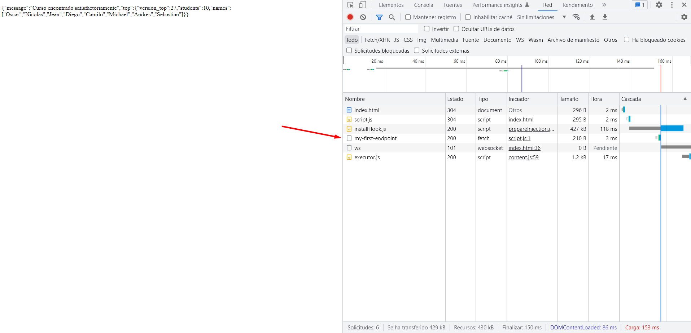

# EXPRESS 2

Esta es una solución al proyecto **EXPRESS 2** del curso Make It Real.

## Tabla de contenido

- [EXPRESS 2](#express-2)
  - [Tabla de contenido](#tabla-de-contenido)
  - [Resumen](#resumen)
    - [El reto](#el-reto)
    - [Captura de pantalla](#captura-de-pantalla)
  - [Autor](#autor)

## Resumen

El reto consiste en generar 1 endpoint funcional `http://localhost:8080/my-first-endpoint` que debe retornar un objeto json con la siguiente información:

```json
{
		message: "Curso encontrado satisfactoriamente"
		top:{
			version_top: 27,
			students: 10,
			names: [
				"Oscar",
				"Nicolas",
				"Jean",
				"Diego",
				"Camilo",
				"Michael",
				"Andres",
				"Sebastian",
			]
		}
}
```

### El reto

Para resolver el reto se siguieron los siguientes pasos:

- iniciar el proyecto de Node con `npm init`
- instalar las dependencias de Express y Nodemon con `npm install express` y `npm install -D nodemon` respectivamente
- crear los scripts `start` y `dev` dentro del fichero `package.json`
- dentro del archivo `index.js`, se importa la librería de Express, se crea la aplicación de Express, se crea un objeto con la información a retornar, se crea el endpoint el cual retorna la información solicitada con un status code 200,se abre el puerto 8080 que escucha las peticiones
- se crea una carpeta `front` que contiene un archivo `.html` y uno `.js`, esto se hace con el fin de hacer una petición al servidor y verificar el código de status
- en el archivo `script.js` se hace la petición al servidor usando fetch

### Captura de pantalla

Se verifica el código de status


## Autor

- Adrian Camilo Gil
